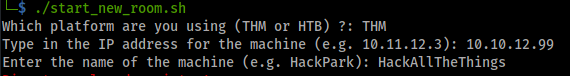
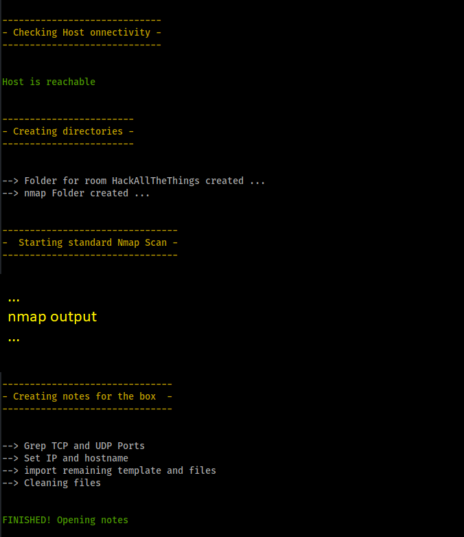
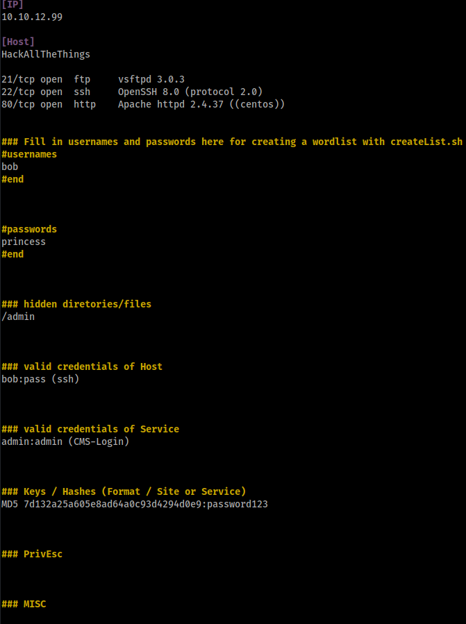
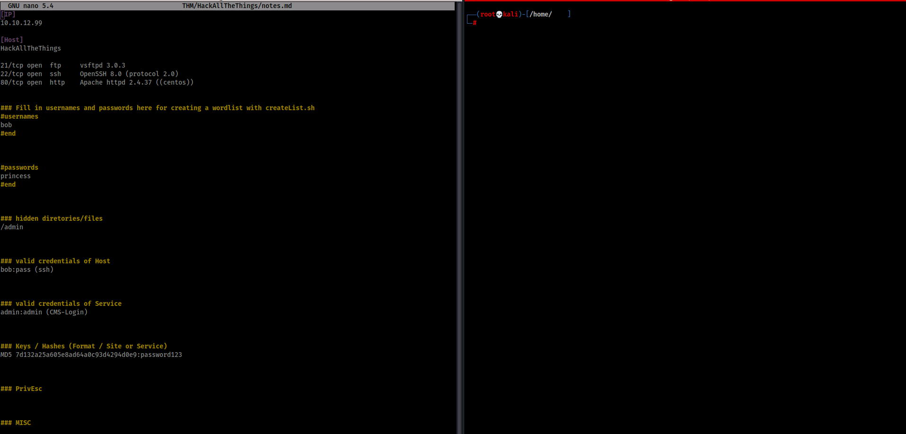

# RoomPrepper
A simple script to create folders and a notes file. I use it for TryhackMe and HackTheBox

Also check out my writeups for TryHackMe / HackTheBox or Vulnhub machines --> https://writeupsforhacking.wordpress.com/
Add me on TryHackMe --> https://tryhackme.com/p/MightyIT

[Changelog:latest]
 
- parts of script placed in functions
- no need to have the folders THM / HTB created. If you choose THM / HTB / VULN it will check existence and create them if needed
- it´s possible to "load" existing notes when folders already existing or you start again by deleting it

The folders for the platform will be created in the home directory (~/THM/BOXNAME)

## Usage:

./start_new_room  
./createLists.sh (to create a user.lst & password.lst out of your notes.md)

## Screen with example input

## When the script is finishing

## The notes will be opened at the end and they look like this.

It´s super handy when you use terminator with split screen layout. So you can start with gobuster and other tools.

